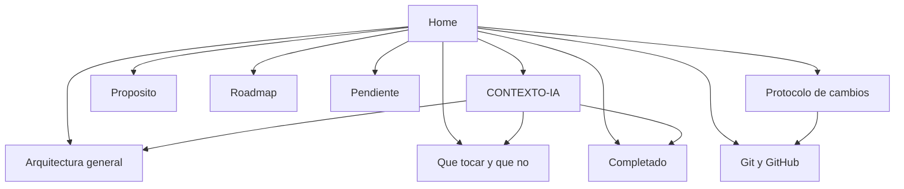

# Web Dieta — Bóveda del proyecto

> **Punto de entrada.** Para dar contexto a una IA sin historial, usa: [[CONTEXTO-IA]].

## Qué es este proyecto

Aplicación web **sin registro** (modo invitado) que genera un **plan de dieta mensual** y un **plan de ejercicio de 4 semanas** a partir de datos que normalmente darías a un dietista y un entrenador.

- **Demo:** https://ionut5251.github.io/dietaweb/
- **Repo:** https://github.com/ionut5251/dietaweb

## Mapa de la bóveda

## Navegación rápida

| Área | Notas |
|------|--------|
| Visión | [[Proposito]] · [[Roadmap]] |
| Arquitectura | [[Arquitectura general]] · [[Flujo de datos]] · [[Local vs GitHub Pages]] |
| Código | [[Que tocar y que no]] · [[Shared]] · [[Frontend]] · [[Backend]] · [[Raiz y despliegue]] |
| Funciones | [[Formulario invitado]] · [[Plan de dieta]] · [[Plan de ejercicio]] · [[Registro de pesos]] · [[Personalizacion y modos]] |
| Estado | [[Completado]] · [[En progreso]] · [[Pendiente]] |
| Operaciones | [[Git y GitHub]] · [[Sincronizar Pages]] · [[Protocolo de cambios]] · [[Actualizar documentacion]] |

## Regla de oro

Cualquier cambio de código → **Git push** + **actualizar notas en `dietas/`** (ver [[Protocolo de cambios]]).

---
*Última revisión de la bóveda: 2026-05-22*
