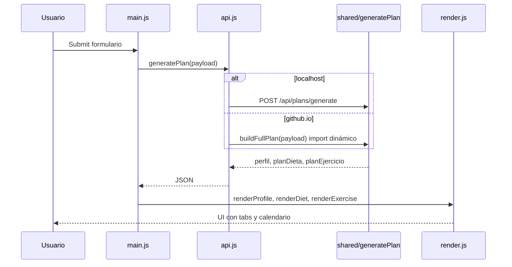

# Flujo de datos

## Generar un plan (happy path)

## Validación

1. `validatePlanInput(body)` en `shared/utils/validateInput.js`
2. Si falla → HTTP 400 (API) o error en cliente con lista `detalles`

## Cálculo nutricional

1. `calculateBMR` (Mifflin-St Jeor)
2. `calculateTDEE` × factor actividad
3. `calculateTargets` según objetivo (déficit/superávit, proteína g/kg)

## Plan de dieta

- `MEAL_SLOTS_BY_COUNT` según comidas/día (1–5)
- 28 días únicos rotando plantillas en `mealTemplates.js`
- Salida: `planMensual.semanas[].dias[].comidas[]`

## Plan de ejercicio

- Plantilla según `diasEntrenoSemana` (2–7)
- 4 objetos `semanas[]`, cada uno con `sesiones[]`
- Semanas 1–2: `bloque A`; 3–4: `bloque B` (otro nombre de ejercicio, mismo `enfoque`)

## Persistencia en cliente

Solo **pesos de gym**: `frontend/js/tracking.js` → `localStorage` clave `web-dieta-pesos:{planId}:...`

Ver: [[Registro de pesos]], [[Plan de dieta]], [[Plan de ejercicio]].
